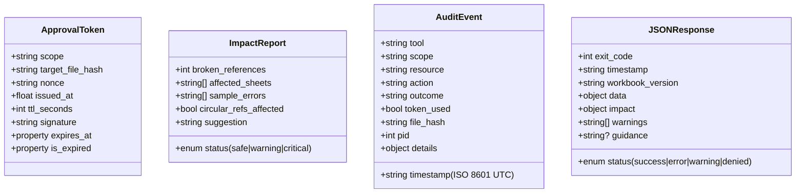
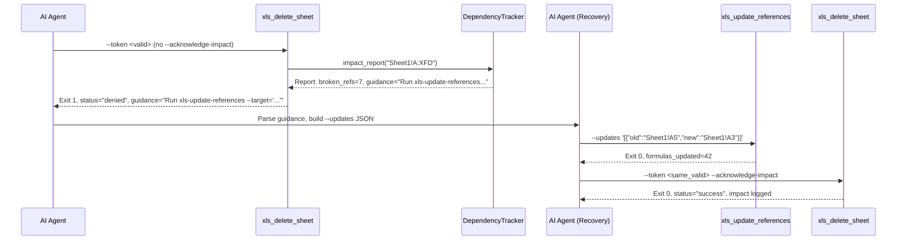

# 📘 Project Architecture Document (PAD)
**Project:** `excel-agent-tools` v1.0.0  
**Document Type:** Single Source-of-Truth Handbook  
**Audience:** New Developers, AI Coding Agents, Technical Reviewers  
**Last Validated:** April 2026 | **Status:** Production-Ready  

---

## 🎯 1. Executive Summary & Design Principles

`excel-agent-tools` is a production-grade, headless Python CLI suite of **53 stateless tools** enabling AI agents to safely read, mutate, calculate, and export Excel workbooks without Microsoft Excel or COM dependencies. The architecture enforces a **Governance-First, AI-Native** paradigm: destructive operations require cryptographic approval tokens, pre-flight dependency impact reports, and clone-before-edit workflows.

### Core Design Principles
| Principle | Implementation |
|:---|:---|
| **Governance-First** | HMAC-SHA256 scoped tokens with TTL, nonce, file-hash binding. Denial-with-prescriptive-guidance pattern. |
| **Formula Integrity** | `DependencyTracker` builds AST graphs via `openpyxl.Tokenizer`. Blocks mutations breaking `#REF!` chains. |
| **AI-Native Contracts** | Strict JSON `stdout`, standardized exit codes (`0–5`), stateless CLI, zero TTY assumptions. |
| **Headless & Portable** | Zero Excel dependency. Linux/macOS/Windows ready. CI-matrix validated. |
| **Clone-Before-Edit** | Source files are immutable. Atomic copies to `/work/` are the mandatory mutation surface. |
| **Pluggable Extensibility** | `MacroAnalyzer` & `AuditBackend` Protocols isolate maintenance-heavy deps (`oletools`). |

---

## 🏗 2. System Architecture Overview

```mermaid
graph TD
    Agent[🤖 AI Agent / Orchestrator]
    CLI[📦 CLI Tool Layer (53 Entry Points)]
    Base[🔧 _tool_base.run_tool() Wrapper]
    Core[⚙️ Core Hub]
    Ext[🔌 External Engines]
    FS[💾 Filesystem / Workbooks]

    Agent -->|JSON Args| CLI
    CLI -->|subprocess| Base
    Base -->|Validate Schema & Args| Core
    Base -->|JSON Response| Agent

    subgraph Core Hub
        AgentCtx[ExcelAgent\nContext Manager]
        DepTracker[DependencyTracker\nFormula Graph]
        TokenMgr[ApprovalTokenManager\nHMAC-SHA256]
        Audit[AuditTrail\nPluggable Backend]
        Macro[MacroAnalyzer\nProtocol]
    end

    Base --> AgentCtx
    Base --> DepTracker
    Base --> TokenMgr
    Base --> Macro
    AgentCtx --> Audit

    subgraph External Engines
        OpenPyXL[openpyxl 3.1.5\nStructure & I/O]
        Defused[defusedxml 0.7.1\nXXE Defense]
        Formulas[formulas 1.3.4\nTier 1 Calc]
        LO[LibreOffice Headless\nTier 2 Calc]
        Ole[oletools 0.60.2\nVBA Analysis]
    end

    Core --> OpenPyXL
    Core --> Defused
    Core --> Formulas
    Core --> LO
    Core --> Ole

    Core --> FS
    OpenPyXL --> FS
    LO --> FS
```

---

## 📁 3. File Hierarchy & Component Registry

```text
excel-agent-tools/
├── 📄 pyproject.toml           # Build, metadata, 53 entry points, ruff/mypy/pytest config
├── 📂 src/excel_agent/
│   ├── 📂 core/                # Foundation layer
│   │   ├── 📜 agent.py         # ExcelAgent: Lock → Load → Hash → Verify → Save lifecycle
│   │   ├── 📜 locking.py       # Cross-platform FileLock (fcntl/msvcrt, sidecar .lock)
│   │   ├── 📜 serializers.py   # RangeSerializer: A1, R1C1, Named, Table → Coordinates
│   │   ├── 📜 dependency.py    # DependencyTracker: Tokenizer, BFS, Tarjan's SCC
│   │   ├── 📜 version_hash.py  # Geometry & File hashing (SHA-256, excludes values)
│   │   ├── 📜 formula_updater.py # Reference shifting for structural mutations
│   │   ├── 📜 chunked_io.py    # Streaming read/write for >100k rows
│   │   └── 📜 type_coercion.py # JSON → Python type inference for cell writes
│   ├── 📂 governance/          # Security & Compliance
│   │   ├── 📜 token_manager.py # ApprovalTokenManager: HMAC, TTL, nonce, compare_digest
│   │   ├── 📜 audit_trail.py   # AuditTrail: Jsonl/Null/Composite backends
│   │   └── 📂 schemas/         # JSON Schema Draft 7 validation files
│   ├── 📂 calculation/         # Two-tier calculation engine
│   │   ├── 📜 tier1_engine.py  # In-process `formulas` lib (90.1% coverage)
│   │   └── 📜 tier2_libreoffice.py # Full-fidelity LibreOffice headless wrapper
│   ├── 📂 core/macro_handler.py # MacroAnalyzer Protocol + Oletools implementation
│   ├── 📂 utils/               # Shared utilities
│   │   ├── 📜 exit_codes.py    # ExitCode IntEnum (0-5) + exit_with()
│   │   ├── 📜 json_io.py       # build_response(), ExcelAgentEncoder, print_json()
│   │   ├── 📜 cli_helpers.py   # argparse patterns, path/JSON validation
│   │   └── 📜 exceptions.py    # ExcelAgentError hierarchy + ImpactDeniedError
│   └── 📂 tools/               # 53 CLI entry points (10 categories)
│       ├── 📂 governance/      # clone, validate, token, hash, lock, dependency
│       ├── 📂 read/            # range, sheets, names, tables, style, formula, metadata
│       ├── 📂 write/           # create, template, write-range, write-cell
│       ├── 📂 structure/       # add/delete/rename/move sheet, rows, cols ⚠️
│       ├── 📂 cells/           # merge, unmerge, delete-range, update-refs
│       ├── 📂 formulas/        # set, recalc, detect-errors, convert, copy-down, name
│       ├── 📂 objects/         # table, chart, image, comment, validation
│       ├── 📂 formatting/      # format-range, column-width, freeze, conditional, number
│       ├── 📂 macros/          # has, inspect, validate, remove ⚠️⚠️, inject ⚠️
│       └── 📂 export/          # PDF, CSV, JSON
├── 📂 tests/                   # >90% coverage: unit, integration, property, perf
├── 📂 docs/                    # DESIGN, API, WORKFLOWS, GOVERNANCE, DEVELOPMENT
└── 📂 scripts/                 # install_libreoffice.sh, generate_test_files.py, recalc.py
```
*(⚠️ = Requires approval token)*

---

## 🗃 4. Data Models & Schema Registry (Adapted "Database Schema")

Since `excel-agent-tools` is file-based and stateless, it replaces traditional database tables with **JSON Contracts, Schema Registries, and Audit/Token Payloads**. These serve as the authoritative data schema.

### 4.1 Input Validation Schemas (`governance/schemas/*.schema.json`)
```mermaid
classDiagram
    class RangeInput {
        +string range (A1 or {start_row, start_col, end_row, end_col})
        +string? sheet
    }
    class WriteData {
        +array~array~ data (2D cell values: str|num|bool|null)
    }
    class StyleSpec {
        +object? font (name, size, bold, color)
        +object? fill (fgColor, patternType)
        +object? border (top, bottom, left, right)
        +object? alignment (horizontal, vertical)
        +string? number_format
    }
    class TokenRequest {
        +enum scope (7 valid scopes)
        +string target_file
        +int? ttl_seconds (1-3600)
    }
```

### 4.2 Core Data Structures (In-Memory & Serialized)


---

## 🔄 5. Core Application Flowcharts

### 5.1 Tool Execution Lifecycle
```mermaid
flowchart TD
    Start([CLI Invocation]) --> Parse[Parse CLI Args]
    Parse --> Validate[Validate JSON Schema & Paths]
    Validate -->|Invalid| Exit1[Exit 1: Validation Error]
    
    Validate -->|Valid| TokenCheck{Requires Token?}
    TokenCheck -->|Yes| HMAC{Validate HMAC-SHA256\n(compare_digest, TTL, nonce)}
    HMAC -->|Invalid| Exit4[Exit 4: Permission Denied]
    
    TokenCheck -->|No| Lock
    HMAC -->|Valid| Lock[Acquire OS FileLock\nSidecar .lock + exponential backoff]
    Lock -->|Contention| Exit3[Exit 3: Lock Contention]
    
    Lock -->|Acquired| Load[ExcelAgent: Load Workbook\nCompute Entry File Hash]
    Load --> Impact{Destructive Op?}
    
    Impact -->|Yes| Tracker[DependencyTracker.impact_report()]
    Tracker -->|Breaks Refs| Denial{--acknowledge-impact?}
    Denial -->|No| ExitDeny[Exit 1: Impact Denied + Prescriptive Guidance]
    Denial -->|Yes| Mutate
    Tracker -->|Safe| Mutate
    Impact -->|No| Mutate[Execute Tool Logic]
    
    Mutate --> Verify[Re-verify File Hash]
    Verify -->|Changed| Exit5[Exit 5: Concurrent Modification]
    Verify -->|Clean| Save[Save Workbook + fsync]
    Save --> Audit[Log to AuditTrail]
    Audit --> Unlock[Release Lock]
    Unlock --> Success([Exit 0: JSON Response])
```

### 5.2 Governance Denial & Remediation Loop


### 5.3 Two-Tier Calculation Fallback
```mermaid
flowchart LR
    Recalc[xls_recalculate] --> Tier1{Tier 1 Available?}
    Tier1 -->|Yes| Calc1[Tier1Calculator\n(formulas 1.3.4)\n~50ms, 90% coverage]
    Tier1 -->|No| Calc2[Tier2Calculator\n(LibreOffice)\nFull fidelity, ~1-10s]
    
    Calc1 --> Check{Unsupported Functions\nor XlError?}
    Check -->|No| Success1[Exit 0: Tier 1 Result]
    Check -->|Yes| Fallback[Tier 2 Auto-Fallback\nLog tier1_fallback_reason]
    Fallback --> Calc2
    Calc2 --> Success2[Exit 0: Tier 2 Result]
```

---

## 🛠 6. Tool Execution Pipeline & Developer Hooks

Every tool follows an identical execution pattern enforced by `_tool_base.run_tool()`:

```python
def run_tool(func: Callable[[], dict]) -> None:
    try:
        result = func()
        print_json(result)
        sys.exit(result.get("exit_code", 0))
    except ExcelAgentError as exc:
        # Maps to exit codes 1-4, injects guidance/impact if ImpactDeniedError
        error_response = build_response("error", None, exit_code=exc.exit_code)
        error_response["error"] = str(exc)
        print_json(error_response)
        sys.exit(exc.exit_code)
    except Exception as exc:
        # Catches all unexpected failures → exit 5
        error_response = build_response("error", None, exit_code=5)
        error_response["traceback"] = traceback.format_exc()
        print_json(error_response)
        sys.exit(5)
```

**Key Implications for PRs:**
- Never use `print()` directly in tools. Always return `dict` from `_run()`.
- Never catch `Exception` at tool level. Let `run_tool()` handle it.
- Always use `ExcelAgent` context manager for file I/O.
- Always validate inputs against `jsonschema` before core logic.

---

## 🔐 7. Governance & Security Architecture

| Component | Security Mechanism | Validation |
|:---|:---|:---|
| **Tokens** | `hmac.compare_digest()` (RFC 2104 constant-time), `secrets.token_hex(16)` nonce, 256-bit secret | Prevents timing attacks & replay |
| **Scope Binding** | `scope|file_hash|nonce|issued_at|ttl` canonical string | Mathematically impossible cross-file reuse |
| **Audit Trail** | Append-only JSONL + `os.fsync()` + advisory lock | Atomic, tamper-evident, concurrent-safe |
| **Macro Safety** | `MacroAnalyzer` Protocol, `scan_risk()` pre-condition on inject | `oletools` isolated, source never logged |
| **XML Defense** | Mandatory `defusedxml` import | Blocks XXE & Billion Laughs |
| **File Integrity** | Geometry hash (formulas/structure) vs File hash (bytes) | Detects silent value changes vs structural mutations |

---

## 🧮 8. Calculation & Macro Engine Architecture

### 8.1 Calculation Engine (`calculation/`)
- **Tier 1 (`formulas` 1.3.4):** Compiles `.xlsx` to Python AST. Executes in-process. **Limitation:** Operates on disk files, not in-memory openpyxl workbooks. Workflow: `save → calc → reload`.
- **Tier 2 (LibreOffice):** `soffice --headless --convert-to xlsx`. Uses isolated per-process user profiles (`-env:UserInstallation`) to prevent lock contention during parallel CI/CD runs.
- **Auto-Fallback:** If Tier 1 throws `NotImplementedError` or returns `XlError`, Tier 2 is invoked automatically. Reason tracked in response JSON.

### 8.2 Macro Handler (`core/macro_handler.py`)
```python
class MacroAnalyzer(Protocol):
    def has_macros(self, path: Path) -> bool: ...
    def extract_modules(self, path: Path) -> list[MacroModule]: ...
    def detect_auto_exec(self, path: Path) -> list[AutoExecTrigger]: ...
    def detect_suspicious(self, path: Path) -> list[SuspiciousKeyword]: ...
    def scan_risk(self, path: Path) -> RiskReport: ...
```
- **Risk Levels:** `low` (clean) → `medium` (auto-exec) → `high` (suspicious keywords) → `critical` (auto-exec + suspicious).
- **Injection Rule:** `xls_inject_vba_project.py` **refuses** to inject without a prior `scan_risk()` pass. High/Critical requires `--force` + token.

---

## 📝 9. Developer Onboarding & PR Workflow Guide

### 9.1 Local Setup
```bash
python3.12 -m venv .venv && source .venv/bin/activate
pip install -r requirements-dev.txt && pip install -e .
pre-commit install
python scripts/generate_test_files.py
```

### 9.2 Adding a New Tool
1. Create file in correct `src/excel_agent/tools/<category>/xls_<name>.py`
2. Implement `_run() -> dict` following the `_tool_base` pattern
3. Register entry point in `pyproject.toml` under `[project.scripts]`
4. Add JSON schema if accepting complex input (place in `governance/schemas/`)
5. Write unit test in `tests/unit/` + integration test in `tests/integration/`
6. Update `docs/API.md` & `README.md`

### 9.3 CI/CD Gates (Non-Negotiable)
| Gate | Command | Threshold |
|:---|:---|:---|
| Formatting | `black --check src/ tools/ tests/` | 0 violations |
| Linting | `ruff check src/ tools/` | 0 errors |
| Type Checking | `mypy --strict src/` | 0 errors |
| Testing | `pytest --cov=excel_agent --cov-fail-under=90` | ≥90% coverage |
| Integration | `pytest -m integration` | 100% pass |

### 9.4 Debugging & Testing Tips
- **Agent Simulation:** Always test via `subprocess.run()` to mimic real CLI invocation. Do not import tool functions directly in integration tests.
- **Token Testing:** Set `EXCEL_AGENT_SECRET=test-key` in test env. Use `ApprovalTokenManager(secret_key=...)` for deterministic validation.
- **Large Files:** Use `read_only=True` and `chunked_io.py` for >50k rows. Never load full sheet into memory.
- **Windows Locking:** CI runs on Linux. Windows `msvcrt.locking()` must be tested manually or via `pytest.mark.skipif(sys.platform == "win32")` with explicit local validation.

---

## ✅ 10. Validation & Alignment Matrix

| Master Plan Requirement | PAD Implementation | Status |
|:---|:---|:---|
| 53 CLI Tools, JSON I/O, Exit 0-5 | `_tool_base.run_tool()`, `build_response()`, `ExitCode` enum | ✅ Aligned |
| Governance-First Tokens | `ApprovalTokenManager`, HMAC, TTL, nonce, `compare_digest` | ✅ Aligned |
| Formula Integrity Pre-flight | `DependencyTracker`, Tarjan's SCC, `ImpactDeniedError` + guidance | ✅ Aligned |
| Clone-Before-Edit | `xls_clone_workbook.py`, immutable source policy | ✅ Aligned |
| Two-Tier Calculation | `formulas` 1.3.4 (Tier 1) → LibreOffice (Tier 2) | ✅ Aligned |
| Macro Safety Protocol | `MacroAnalyzer` Protocol, `oletools` backend, `scan_risk()` | ✅ Aligned |
| Headless & Server-Ready | Zero COM, `defusedxml` mandatory, CI matrix, Docker-ready | ✅ Aligned |
| Audit Trail | Pluggable `AuditBackend`, JSONL append, privacy guards | ✅ Aligned |
| Python ≥3.12 Floor | `pyproject.toml` `requires-python=">=3.12"`, strict typing | ✅ Aligned |

---

## 📎 Appendix: Quick Reference Tables

### Exit Code Semantics
| Code | Meaning | Agent Recovery Action |
|:---:|:---|:---|
| `0` | Success | Parse `data`, chain to next tool |
| `1` | Validation / Impact Denial | Fix JSON input or run remediation tool |
| `2` | File Not Found | Verify path, download missing file |
| `3` | Lock Contention | Exponential backoff retry (`0.5s → 1s → 2s`) |
| `4` | Permission Denied | Request new token with correct scope |
| `5` | Internal Error | Halt workflow, alert operator, attach traceback |

### Token Scopes
`sheet:delete`, `sheet:rename`, `range:delete`, `formula:convert`, `macro:remove`, `macro:inject`, `structure:modify`

### Key Dependencies (Pinned)
| Package | Version | Purpose |
|:---|:---|:---|
| `openpyxl` | `3.1.5` | Core .xlsx/.xlsm I/O |
| `defusedxml` | `0.7.1` | XML attack prevention (Mandatory) |
| `formulas[excel]` | `1.3.4` | Tier 1 in-process calculation |
| `oletools` | `0.60.2` | VBA/XLM risk scanning (Protocol-wrapped) |
| `jsonschema` | `>=4.23.0` | Input contract validation |
| `pandas` | `>=2.1.0` | Internal chunked I/O only |

---
**Document End.**  
This PAD serves as the authoritative blueprint. Any deviation in PRs must be documented with explicit architectural justification and validated against the Master Execution Plan.

# https://chat.qwen.ai/s/f74ed7fe-fd45-4541-9ca0-2147d665b0e3?fev=0.2.36 

