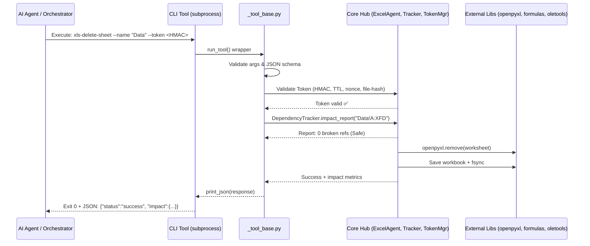
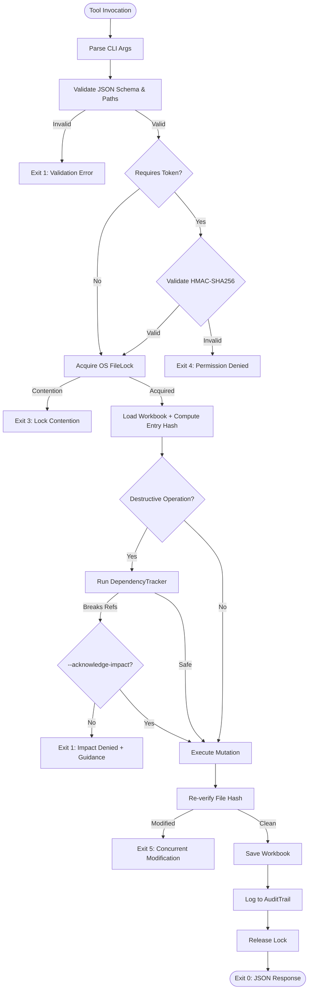

# excel-agent-tools

> **53 governance-first, AI-native CLI tools for safe, headless Excel manipulation.**

[](https://github.com/<ORGANIZATION>/<REPOSITORY>/actions/workflows/ci.yml)
[](https://codecov.io/gh/<ORGANIZATION>/<REPOSITORY>)
[](https://pypi.org/project/excel-agent-tools/)
[](https://pypi.org/project/excel-agent-tools/)
[](LICENSE)
[](https://pepy.tech/project/excel-agent-tools)

---

## 🤔 Why `excel-agent-tools`?

AI agents need to manipulate spreadsheets safely. Existing automation approaches suffer from critical gaps:
- 🚫 **Require Excel/COM:** Break in headless, serverless, or Linux environments.
- 🚫 **Silent Formula Breakage:** Structural edits (`delete_row`, `rename_sheet`) silently corrupt `#REF!` chains.
- 🚫 **No Governance:** Destructive operations lack approval gates, audit trails, or rollback safety.
- 🚫 **Poor Agent UX:** Inconsistent exit codes, unstructured stdout, and no prescriptive error recovery.

`excel-agent-tools` solves this with **53 stateless, JSON-native CLI tools** designed specifically for autonomous orchestration:
- ✅ **Headless & Server-Ready:** Zero Microsoft Excel dependency. Powered by `openpyxl`, `formulas`, and optional LibreOffice.
- ✅ **Formula Integrity Preservation:** Pre-flight dependency graphs block mutations that would break references.
- ✅ **Governance-First:** HMAC-SHA256 scoped tokens, TTL, nonce tracking, and immutable audit trails.
- ✅ **AI-Native Contracts:** Strict JSON envelopes, standardized exit codes (`0–5`), and denial-with-prescriptive-guidance.

---

## 🚀 Quick Start

### 1. Installation
```bash
pip install excel-agent-tools

# For full-fidelity recalculation (Tier 2), install LibreOffice headless:
# Ubuntu/Debian: sudo apt-get install -y libreoffice-calc
# macOS: brew install --cask libreoffice
# Windows: choco install libreoffice-fresh
```

### 2. 3-Step Workflow: Clone → Modify → Validate
```bash
# 1. Clone source to a safe working copy (never mutate originals)
xls-clone-workbook --input financials.xlsx --output-dir ./work/

# 2. Write data to the working copy
xls-write-range --input ./work/financials_*.xlsx \
  --output ./work/financials_*.xlsx \
  --range A1 --sheet Q1 --data '[["Revenue","Cost"],[50000,32000]]'

# 3. Validate integrity before proceeding
xls-validate-workbook --input ./work/financials_*.xlsx
```

### 3. Governance: Token-Protected Deletion
```bash
# Generate a scoped approval token (expires in 5 min)
TOKEN=$(xls-approve-token --scope sheet:delete --file ./work/financials.xlsx --ttl 300 | jq -r '.data.token')

# Delete sheet with pre-flight dependency check
xls-delete-sheet --input ./work/financials.xlsx \
  --output ./output/clean.xlsx \
  --name "OldSheet" --token "$TOKEN"
```

---

## 🌟 Key Features

| Feature | Description |
|:---|:---|
| 🛡️ **Governance-First** | Destructive ops require scoped HMAC-SHA256 tokens with TTL, nonce, and file-hash binding. |
| 🔗 **Formula Integrity** | `DependencyTracker` builds AST graphs to block mutations that break `#REF!` chains. |
| 🤖 **AI-Native UX** | JSON stdin/stdout, standardized exit codes (`0-5`), stateless chaining, prescriptive guidance. |
| ☁️ **Headless Operation** | Runs on any server. No Excel, no COM, no GUI dependencies. |
| 🔒 **File Safety** | OS-level cross-platform locking, clone-before-edit enforcement, geometry hash verification. |
| 📊 **Two-Tier Calculation** | Tier 1 (`formulas` lib, ~50ms for 10k formulas) → Tier 2 (LibreOffice headless fallback). |
| 🦠 **Macro Safety** | `oletools`-backed risk scanning, read-only isolation, pre-scan before any `.bin` injection. |
| 📝 **Pluggable Audit** | Append-only JSONL trails by default. Swap to SIEM/webhooks via `AuditBackend` Protocol. |

---

## 🏗 Architecture Overview

### 📁 File Hierarchy & Key Components
```text
excel-agent-tools/
├── 📄 pyproject.toml           # 53 entry points, deps, tool configs (ruff, mypy, pytest)
├── 📂 src/excel_agent/
│   ├── 📂 core/                # Foundation: Agent, Lock, Serializer, Dependency, Hash
│   │   ├── 📜 agent.py         # ExcelAgent context manager (Lock → Load → Hash → Save)
│   │   ├── 📜 locking.py       # Cross-platform OS-level locking (fcntl/msvcrt)
│   │   ├── 📜 serializers.py   # Unified range parser (A1, R1C1, Named, Table)
│   │   ├── 📜 dependency.py    # Formula dependency graph + Tarjan's SCC for cycles
│   │   └── 📜 version_hash.py  # Geometry-aware SHA-256 hashing (formulas, not values)
│   ├── 📂 governance/          # Security: Tokens, Audit, Schemas
│   │   ├── 📜 token_manager.py # HMAC-SHA256 scoped tokens with constant-time validation
│   │   └── 📜 audit_trail.py   # Pluggable AuditBackend Protocol (JSONL default)
│   ├── 📂 calculation/         # Two-tier engine
│   │   ├── 📜 tier1_engine.py  # In-process `formulas` library (~90% coverage)
│   │   └── 📜 tier2_libreoffice.py # Full-fidelity LibreOffice headless fallback
│   └── 📂 utils/               # CLI helpers, JSON I/O, ExitCode enum, Custom Exceptions
├── 📂 tools/                   # 53 CLI entry points (10 categories)
│   ├── 📂 governance/          # clone, validate, token, hash, lock, dependency
│   ├── 📂 read/                # range, sheets, names, tables, style, formula, metadata
│   ├── 📂 write/               # create, template, write-range, write-cell
│   ├── 📂 structure/           # ⚠️ add/delete/rename/move sheet, rows, cols
│   ├── 📂 cells/               # merge, unmerge, delete-range, update-refs
│   ├── 📂 formulas/            # set, recalc, detect-errors, convert, copy-down, define-name
│   ├── 📂 objects/             # table, chart, image, comment, validation
│   ├── 📂 formatting/          # format-range, column-width, freeze, conditional, number
│   ├── 📂 macros/              # ⚠️ has, inspect, validate-safety, remove, inject
│   └── 📂 export/              # PDF, CSV, JSON
├── 📂 tests/                   # >90% coverage: unit, integration, property, performance
├── 📂 docs/                    # DESIGN, API, WORKFLOWS, GOVERNANCE, DEVELOPMENT
└── 📂 scripts/                 # LibreOffice installer, test fixture generator
```

### 🔄 User & Application Interaction (Sequence)


### ⚙️ Application Logic Flow


---

## 🧭 Design Philosophy

| Principle | Implementation in Code |
|:---|:---|
| **Governance-First** | `ApprovalTokenManager` with `hmac.compare_digest()`, nonce tracking, file-hash binding. |
| **Formula Integrity** | `DependencyTracker` blocks mutations with `ImpactDeniedError` + prescriptive `guidance`. |
| **Clone-Before-Edit** | Source files are never mutated in-place. `xls_clone_workbook` is the mandatory entry point. |
| **AI-Native Contracts** | Every tool outputs strict JSON. Exit codes `0-5` map to agent recovery patterns (retry, fix, escalate). |
| **Headless & Portable** | Zero COM/Windows dependency. Linux/macOS/WSL ready. CI-matrix validated. |

---

## 📦 Tool Catalog (53 Tools)

| Category | Count | Description | Governance |
|:---|:---:|:---|:---|
| 🔐 **Governance** | 6 | Clone, validate, approve token, version hash, lock status, dependency report | Token gen, Audit |
| 📖 **Read** | 7 | Range data, sheet names, defined names, tables, styles, formulas, metadata | Read-only |
| ✍️ **Write** | 4 | Create new, template substitution, write range, write cell | Type inference |
| 🏗 **Structure** | 8 | Add/delete/rename/move sheet, insert/delete rows & cols | ⚠️ Token + Impact Check |
| 📐 **Cells** | 4 | Merge, unmerge, delete range, batch update references | ⚠️ Token (delete) |
| 🧮 **Formulas** | 6 | Set formula, recalculate, detect errors, convert to values, copy down, define name | ⚠️ Token (convert) |
| 📊 **Objects** | 5 | Tables, charts, images, comments, data validation | Additive |
| 🎨 **Formatting** | 5 | Range styles, column width, freeze panes, conditional formatting, number formats | Additive |
| 🦠 **Macros** | 5 | Detect, inspect, validate safety, remove, inject VBA | ⚠️⚠️ Token + Pre-scan |
| 📤 **Export** | 3 | PDF (via LibreOffice), CSV, JSON | Read-only |

⚠️ = Requires `--token` and `--acknowledge-impact` if dependencies exist.

---

## 🔌 Standardized Interfaces

### JSON Response Envelope
Every tool writes **exactly one** valid JSON object to `stdout`.
```json
{
  "status": "success",
  "exit_code": 0,
  "timestamp": "2026-04-08T14:30:22+00:00",
  "workbook_version": "sha256:a1b2c3...",
  "data": { "sheets": ["Q1", "Q2"], "count": 2 },
  "impact": { "cells_modified": 4, "formulas_updated": 2 },
  "warnings": ["Large image detected in B5 (>1MB)"],
  "guidance": null
}
```

### Exit Code Semantics (Agent Recovery Map)
| Code | Meaning | Agent Action |
|:---:|:---|:---|
| `0` | Success | Parse `data`, proceed to next tool. |
| `1` | Validation / Impact Denial | Fix JSON input, run remediation tool, or retry with `--acknowledge-impact`. |
| `2` | File Not Found | Verify path, download missing file, or alert user. |
| `3` | Lock Contention | Implement exponential backoff retry (e.g., `0.5s → 1s → 2s`). |
| `4` | Permission Denied | Request new token from orchestrator with correct `scope`. |
| `5` | Internal Error | Halt workflow, alert human operator, attach `traceback`. |

---

## 🛡 Governance & Safety Protocol

1. **Token Lifecycle:** Generate → Validate (scope, file-hash, TTL, nonce) → Use → Revoke. Constant-time comparison prevents timing attacks.
2. **Clone-Before-Edit:** Source workbooks are immutable. All mutations happen on timestamped clones. Final validation ensures integrity before export.
3. **Impact Denial & Guidance:** If a structural change breaks formulas, the tool exits with code `1` and provides exact remediation steps:
   > `"guidance": "Run xls-update-references --target='Sheet1!A5:A10' before retrying."`
4. **Audit Trail:** Every operation appends to `.excel_agent_audit.jsonl`. Macro source code **never** enters the log; only hashes and metadata are persisted for compliance.

---

## ☁️ Deployment

### 📦 PyPI Package
```bash
pip install excel-agent-tools
```

### 🐳 Docker Container
Run headless in isolated containers. Ideal for Kubernetes or AWS Batch.
```dockerfile
FROM python:3.12-slim
RUN apt-get update && apt-get install -y --no-install-recommends \
    libreoffice-calc && \
    pip install excel-agent-tools
WORKDIR /data
ENTRYPOINT ["python", "-m"]
```
```bash
docker run -v $(pwd)/work:/data excel-agent-tools \
  excel_agent.tools.governance.xls_clone_workbook \
  --input report.xlsx --output-dir /data
```

### 🖥 Server / CI Integration
- **GitHub Actions:** Pre-installed LibreOffice matrix. Coverage gate ≥90%.
- **Systemd Service:** Run as unprivileged `excel-agent` user with `EXCEL_AGENT_SECRET` injected via `EnvironmentFile`.
- **Production Checklist:**
  - [ ] Set `EXCEL_AGENT_SECRET` (256-bit hex) in vault/env.
  - [ ] Configure audit backend (default JSONL or webhook).
  - [ ] Enable file locking (`fcntl`/`msvcrt`).
  - [ ] Set up log rotation for `.excel_agent_audit.jsonl`.
  - [ ] Enable health checks (e.g., `xls-version-hash --help`).

---

## 📋 Requirements & Installation

| Component | Requirement | Notes |
|:---|:---|:---|
| **Python** | `≥3.12` | Required for modern stdlib, strict typing, and performance. |
| **Core I/O** | `openpyxl >=3.1.5` | Headless XML parsing. |
| **XML Security** | `defusedxml >=0.7.1` | **Mandatory.** Prevents XXE / billion laughs attacks. |
| **Calc Tier 1** | `formulas[excel] >=1.3.4` | In-process AST evaluation. |
| **Macro Safety** | `oletools >=0.60.2` | VBA/XLM risk scanning (wrapped behind Protocol). |
| **Calc Tier 2** | LibreOffice Headless | Optional. Required for PDF export & 100% formula coverage. |

---

## 🔒 Security Notices

- 🛡️ **XML Defense:** `openpyxl` does not guard against quadratic blowup by default. `excel-agent-tools` enforces `defusedxml` at install.
- 🔐 **Token Cryptography:** All tokens use `hmac.compare_digest()` (RFC 2104) to prevent timing side-channels. Never pass tokens via CLI logs; use env vars or stdin.
- 🦠 **Macro Isolation:** `oletools` is battle-tested but maintenance-inactive. It is isolated behind the `MacroAnalyzer` Protocol for zero-downtime backend swaps. Source code is **never** logged or transmitted.
- 📜 **Audit Privacy:** Audit trails record operation metadata, file hashes, and outcomes. Sensitive payloads (VBA source, raw cell values) are excluded to prevent data leakage.

---

## 📚 Documentation Index

| Document | Description |
|:---|:---|
| [`DESIGN.md`](docs/DESIGN.md) | Deep architecture blueprint, layer boundaries, and trade-off analysis. |
| [`API.md`](docs/API.md) | Complete CLI reference for all 53 tools (args, JSON schema, examples). |
| [`WORKFLOWS.md`](docs/WORKFLOWS.md) | 5 production-ready agent recipes with full I/O traces. |
| [`GOVERNANCE.md`](docs/GOVERNANCE.md) | Token lifecycle, audit schema, safety protocols, and compliance. |
| [`DEVELOPMENT.md`](docs/DEVELOPMENT.md) | Contributor guide, CI setup, adding a new tool, and PR checklist. |

---

## 🤝 Contributing & License

We welcome contributions that maintain the project's **governance-first, research-validated** standards.
- Read [`DEVELOPMENT.md`](docs/DEVELOPMENT.md) for setup, linting, and testing guidelines.
- All PRs require passing the CI matrix (`black`, `ruff`, `mypy --strict`, `pytest --cov=90`).
- New tools must include JSON schema validation, standardized exit codes, and audit logging.

**License:** [MIT](LICENSE)  
© 2026 `excel-agent-tools` contributors.
